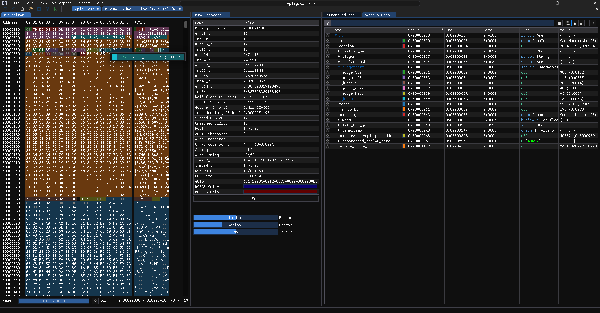

# [ImHex](https://github.com/WerWolv/ImHex) patterns for [osu!](https://osu.ppy.sh)

Supported formats:
- replays, with mode-relevant field names
  - [x] standard
  - [ ] taiko
  - [ ] ctb
  - [ ] mania

Planned:
- charts
- ???

# ?
## "minimal" replay file
This was designed to be my attempt at the absolute minimum required data that I had to send
to the sanity-check-2 server for osu!gaming CTF (2024), which required a >=70% pass on a
particular map. Ps. This is also why I created the parser pattern and this repo :)
